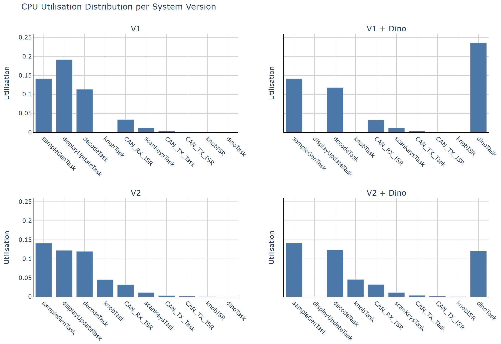

# 5. Scheduling Analysis

[Back to Table of Contents](README.md)

This section evaluates the schedulability of the system under a fixed-priority pre-emptive scheduling model closely following Rate Monotonic Scheduling (RMS). In strict RMS, priorities are assigned according to task periods, with shorter-period tasks receiving higher priority.

However, the implemented system includes a mixture of periodic and event-driven (sporadic) tasks. As discussed in the timing analysis, event-driven tasks are modelled using minimum inter-arrival times. Consequently, strict RMS priority ordering is not always appropriate, and task criticality and system behaviour must also be considered.

The system is therefore analysed using a hybrid approach, in which:

- Periodic tasks follow RMS-based priority assignment.
- Event-driven tasks are assigned priorities based on their effective activation rate and impact on system behaviour.

Using the timing parameters derived in the previous section, the system is analysed to verify that all tasks meet their deadlines under worst-case conditions.

The analysis assumes a fixed-priority pre-emptive scheduling model implemented by FreeRTOS. Each task is characterised by:

- A worst-case execution time $C_i$.
- A minimum initiation interval (period) $T_i$.
- A relative deadline equal to its period.

## 5.1 Task Priority Assignment

Based on the task periods identified in the timing analysis, priorities are assigned as shown in the table below.

| Task | Priority | Period | Type |
| --- | --- | --- | --- |
| `sampleGenTask` | Highest 5 | $T_{DMA} = 5.82\ \text{ms}$ | Hard real-time |
| `CAN_TX_Task` | High 4 | $T_{CAN\_TX}=1.67 \text{ms}$ | Firm real-time |
| `scanKeysTask` | Medium 3 | $T_{scan}= 20\ \text{ms}$ | Firm real-time |
| `decodeTask` | Medium 2 | $T_{decode}=T_{CAN}=120 \mu s$ Worst-case | Firm real-time |
| `knobTask` | Medium 2 | $T_{knob}=5 \text{ms}$ | Firm real-time |
| `dinoTask` | Low 1 | $T_{dino}=60 \text{ms}$ | Soft real-time |
| `displayUpdateTask` | Low 1 | $T_{display}=100\text{ms}$ | Soft real-time |

The audio generation task `sampleGenTask` is assigned the highest priority despite not having the shortest period. This reflects its hard real-time requirement where failure to meet its deadline results in immediate and irreversible degradation of audio output.

Event-driven tasks such as `decodeTask` and `CAN_TX_Task` may exhibit high theoretical activation rates. However, their execution is buffered through queues and does not directly impact time-critical audio generation. As a result, their priorities are assigned to prevent interference with higher-criticality tasks rather than strictly following period-based ordering.

The `knobTask` is treated as a sporadic input task with bounded activation rate. It is assigned a medium priority as it contributes to user interaction and responsiveness but is not critical.

For more accurate scheduling, the ISRs are also profiled. The periods are derived from the worst-case frequencies discussed in `report/tasks.md`

| Interrupt | Period |
| --- | --- |
| `CAN_RX_ISR` | $T_{RX\_ISR}=120 \mu s$ |
| `CAN_TX_ISR` | $T_{TX\_ISR}=1670\mu s$ |
| `knobISR` | $T_{knob}=500$ |

## 5.2 Critical Instant Response-Time Analysis

The worst-case response time of each task is determined using critical instant analysis. The critical instant occurs when a task is released simultaneously with all higher-priority tasks.

The response time $R_i$ of task $i$ is given by:

$$R_i = C_i + \sum_{j<i} \left\lceil \frac{R_i}{T_j} \right\rceil C_j$$

Where:

- $C_i$ is the WCET of task $i$
- $T_j$ is the period of each higher-priority task $j$

This equation is solved iteratively until convergence. A task is schedulable if 

$$R_i\leq T_i$$

Substituting the measured timing parameters obtained in Section 5 allows verification that the deadline of each task is satisfied under worst-case conditions.

## 5.3 Utilisation Bound Test

A sufficient schedulability condition for RMS can also be evaluated using the utilisation bound test.

The total processor utilisation is given by:

$$
U = \sum_{i=1}^{n} \frac{C_i}{T_i}
$$

For $n$ periodic tasks, RMS guarantees schedulability if:

$$
U_{bound} = n(2^{1/n} - 1)
$$

The utilisation bound decreases as the number of tasks increases, approaching approximately 0.69 for large $n$.

Substituting the measured execution times and task periods yields:

### V1

| Task / ISR | WCET $C_i, \mu s$ | Period $T_i \mu s$ | Utilisation $U_i$ |
| --- | --- | --- | --- |
| `sampleGenTask` | 821.78 | 5820 | 0.1412 |
| `scanKeysTask` | 234.44 | 20000 | 0.0117 |
| `decodeTask` | 13.59 | 120 | 0.1133 |
| `CAN_TX_Task` | 6.06 | 1670 | 0.0036 |
| `displayUpdateTask` | 19160.91 | 100000 | 0.1916 |
| `CAN_RX_ISR` | 4.06 | 120 | 0.0338 |
| `CAN_TX_ISR` | 2.81 | 1670 | 0.0017 |

**Utilisation bound:**

$$U_{bound} = 0.7286$$

**Total CPU utilisation:**

$$U_{total} = 0.4969$$

### V1 with Dino

| Task / ISR | WCET $C_i, \mu s$ | Period $T_i \mu s$ | Utilisation $U_i$ |
| --- | --- | --- | --- |
| `sampleGenTask` | 822.00 | 5820 | 0.1412 |
| `scanKeysTask` | 234.41 | 20000 | 0.0117 |
| `decodeTask` | 14.16 | 120 | 0.1180 |
| `CAN_TX_Task` | 6.03 | 1670 | 0.0036 |
| `dinoTask` | 14160.87 | 60000 | 0.2360 |
| `CAN_RX_ISR` | 3.88 | 120 | 0.0323 |
| `CAN_TX_ISR` | 2.66 | 1670 | 0.0016 |

**Utilisation bound:**

$$U_{bound} = 0.7286$$

**Total CPU utilisation:**

$$U_{total} = 0.5445$$

### V2 (I2C Expander)

| Task / ISR | WCET $C_i, \mu s$ | Period $T_i \mu s$ | Utilisation $U_i$ |
| --- | --- | --- | --- |
| `sampleGenTask` | 821.44 | 5820 | 0.1411 |
| `scanKeysTask` | 225.91 | 20000 | 0.0113 |
| `decodeTask` | 14.34 | 120 | 0.1195 |
| `knobTask` | 226.81 | 5000 | 0.0454 |
| `CAN_TX_Task` | 5.56 | 1670 | 0.0033 |
| `displayUpdateTask` | 12206.44 | 100000 | 0.1221 |
| `CAN_RX_ISR` | 3.84 | 120 | 0.0320 |
| `CAN_TX_ISR` | 2.69 | 1670 | 0.0016 |
| `knobISR` | 2.72 | 5000 | 0.0005 |

**Utilisation bound:**

$$U_{bound} = 0.7205$$

**Total CPU utilisation:**

$$U_{total} = 0.4768$$

### V2 (I2C Expander) with Dino

| Task / ISR | WCET $C_i, \mu s$ | Period $T_i \mu s$ | Utilisation $U_i$ |
| --- | --- | --- | --- |
| `sampleGenTask` | 821.94 | 5820 | 0.1412 |
| `scanKeysTask` | 226.41 | 20000 | 0.0113 |
| `decodeTask` | 14.84 | 120 | 0.1237 |
| `knobTask` | 227.91 | 5000 | 0.0456 |
| `CAN_TX_Task` | 6.13 | 1670 | 0.0037 |
| `dinoTask` | 7211.72 | 60000 | 0.1202 |
| `CAN_RX_ISR` | 3.88 | 120 | 0.0323 |
| `CAN_TX_ISR` | 2.72 | 1670 | 0.0016 |
| `knobISR` | 2.72 | 5000 | 0.0005 |

**Utilisation bound:**

$$U_{bound} = 0.7205$$

**Total CPU utilisation:**

$$U_{total} = 0.4802$$

If:

$$
U_{total} < U_{bound}
$$

then the system is guaranteed to be schedulable. The calculations shows that each version of the code is well within the bound, even with very pessimistic WCET estimates.

The figure below presents the worst-case CPU utilisation across the tasks and system versions.

The distribution of CPU utilisation across system components reveals that a small number of tasks dominate processor usage, while the majority contribute only marginal load.

Across all configurations, the audio generation task (`sampleGenTask`) consistently accounts for a significant proportion of utilisation. This is expected, as it performs continuous multi-voice waveform synthesis at a fixed rate and lies on the critical real-time path of the system.

In V1, the display update task is the dominant contributor. This is due to the worst-case workload and relatively high cost of rendering text and transferring frame data over I2C, which involves both computation and communication overhead. In V2, this cost is reduced as a result of a custom I2C communication backend (`u8x8_byte_rtos_hw_i2c`) used by the display driver. This custom implementation replaces the default U8g2 byte transmission routine with a hardware-optimised interface, reducing per-byte overhead and improving transfer efficiency. As a result, the time required to transmit the display buffer is significantly reduced, leading to a lower measured WCET for the display update task.

The `decodeTask` also contributes substantially despite its low execution time per invocation. This is a consequence of its very high worst-case activation rate, derived from the theoretical maximum CAN message frequency. This highlights the importance of considering both execution time and activation rate when evaluating system load.

When the Dino game is enabled, the `dinoTask` becomes a dominant contributor, particularly in the V1 configuration. This is due to the relatively high computational cost of game logic and rendering at a fixed refresh rate. However, as this task is classified as soft real-time, its impact does not compromise system correctness.

Other tasks and ISRs, including CAN transmission, key scanning, and encoder handling, contribute only a small fraction of total utilisation. This reflects an effective design strategy in which interrupt handlers are kept short and computational work is distributed efficiently across tasks.

## 5.4 Scheduler Overhead and Tick Latency

The theoretical analysis assumes ideal scheduling behaviour. In practice, additional latency is introduced by the operating system.

Sources of overhead include:

- Context switching.
- Interrupt handling.
- FreeRTOS scheduling operations.

The scheduler tick introduces a bounded delay before a ready task may be executed. This latency must be considered when evaluating the response time of short-period tasks.

Given that the total CPU utilisation under worst-case execution assumptions is significantly below the theoretical schedulability bound, sufficient processing margin exists to accommodate scheduler overhead, context switching, and interrupt latency.

## 5.5 Scheduler Jitter

Task release jitter occurs when the start time of a task varies slightly between activations. In the FreeRTOS scheduler, pre-emption and task wake-up events are typically aligned with scheduler ticks. Consequently task activation may be delayed by up to one scheduler tick. This jitter introduces small variations in task start times but remains bounded and is accounted for in the response-time analysis.